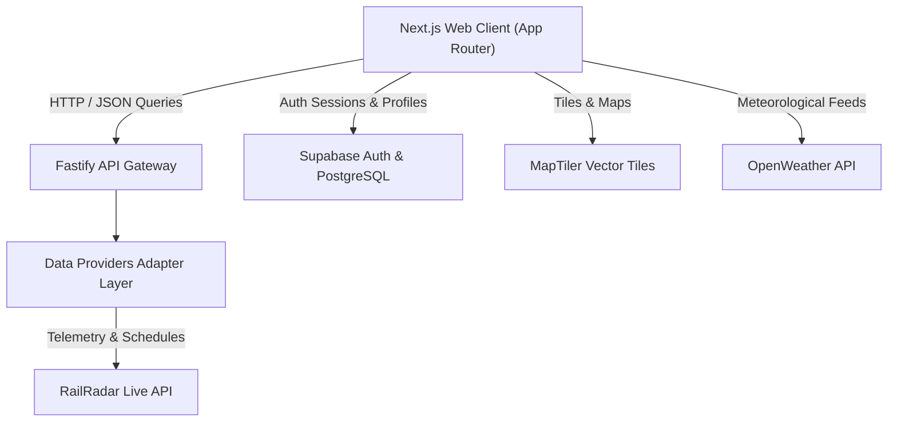

<div align="center">

# Exprest — Live Train Tracking & Journey Intelligence

**High-precision real-time telemetry, vector radar tracking, and route intelligence for Indian Railways.**

[](https://nextjs.org/)
[](https://fastify.dev/)
[](https://www.typescriptlang.org/)
[](https://turbo.build/)
[](https://tailwindcss.com/)

---

</div>

## 📌 Table of Contents

- [Overview](#-overview)
- [Key Features](#-key-features)
- [Architecture & Tech Stack](#-architecture--tech-stack)
- [Repository Structure](#-repository-structure)
- [Getting Started](#-getting-started)
- [Production Setup & Deployment](#-production-setup--deployment)
  - [1. Prerequisites](#1-prerequisites)
  - [2. Installation](#2-installation)
  - [3. Supabase Auth & Database Setup](#3-supabase-auth--database-setup)
  - [4. Google OAuth Setup](#4-google-oauth-setup)
  - [5. Environment Variables Configuration](#5-environment-variables-configuration)
  - [6. Building and Running](#6-building-and-running)
  - [7. Hosting Platform Configuration](#7-hosting-platform-configuration)
- [API Integrations](#-api-integrations)
- [Scripts & Commands](#-scripts--commands)
- [License](#-license)

---

## 🚀 Overview

**Exprest** is a modern, full-stack monorepo application engineered for high-precision live train tracking, schedule analytics, and route intelligence across the Indian Railways network. By synthesizing real-time transponder data, official NTES/RailRadar telemetry, high-resolution vector maps, and ambient meteorological feeds, Exprest presents actionable journey insights through a clean, calm, and distraction-free interface.

---

## ✨ Key Features

| Feature | Description |
| :--- | :--- |
| 🛰️ **Live Vector Radar View** | MapLibre GL-powered dark vector radar map featuring glowing route paths, live train headings, velocity tooltips, and station transponders. |
| ⏱️ **Real-Time Telemetry & Status** | Dynamic tracking of block section signals, speed limits, scheduled vs. actual arrival/departure times, and next station ETAs. |
| 📋 **Complete Running Chart** | Comprehensive station-by-station itinerary table detailing delay variances, halt durations, platform assignments, and live status flags. |
| 🚃 **Coach Composition Array** | Visual physical rake layout specifying coach positioning (LHB/ICF), engine heading, pantry placement, and onboard catering services. |
| 📊 **Journey Analytics & Trends** | Schedule reliability ratings, velocity profiles, delay trend heatmaps, and topographic elevation contours. |
| 🌤️ **Travel Companion & Weather Horizon** | Real-time station microclimate forecasts and route rain radar powered by OpenWeather API. |
| 🌙 **Theme & Personalization** | Native Light & Dark mode support with zero-FOUC (flash of unstyled content) persistence via design tokens. |
| 🔐 **Supabase Authentication Portal** | Production-ready authentication supporting Email/Password and Google OAuth sign-in with row-level secured user profiles. |

---

## 🛠️ Architecture & Tech Stack

Exprest is structured as a TypeScript monorepo using **pnpm Workspaces** and **Turborepo** for build caching and task orchestration.



### Core Technologies

- **Frontend App (`apps/web`)**: Next.js 14 (App Router), React 18, Supabase SSR, Tailwind CSS, TanStack Query, MapLibre GL, Recharts, Zustand.
- **Backend Service (`apps/api`)**: Node.js, Fastify, TypeScript, Zod, Pino Logging, `@fastify/rate-limit`.
- **Database & Auth**: Supabase Auth (Email & Google OAuth) + Supabase PostgreSQL with Row Level Security (RLS).
- **Shared Packages (`packages/`)**:
  - `@exprest/types`: Centralized TypeScript interface definitions for trains, runs, stations, and telemetry.
  - `@exprest/ui`: Design tokens, global CSS variables, and shared UI component primitives.
  - `@exprest/config`: Shared ESLint, Tailwind, and TypeScript configurations.

---

## 📁 Repository Structure

```text
Exprest/
├── apps/
│   ├── api/                    # Fastify backend service & data provider adapters
│   │   ├── src/
│   │   │   ├── providers/      # RailRadar & external API integration layer
│   │   │   ├── routes/         # REST API endpoints (/api/v1/journeys, /shares)
│   │   │   └── app.ts          # Fastify server initialization
│   │   └── package.json
│   └── web/                    # Next.js 14 frontend web application
│       ├── app/                # App Router pages (Home, Journey Overview, Live Map, Analytics, Companion, Auth)
│       ├── components/         # React UI components (Radar Map, Search, Header, Dark Mode)
│       ├── lib/supabase/       # Supabase SSR client initializers (browser & server)
│       └── package.json
├── packages/
│   ├── config/                 # Shared TypeScript & build configs
│   ├── types/                  # Shared domain data models
│   └── ui/                     # Design tokens and global CSS styles
├── supabase/
│   └── migrations/             # Database SQL migration scripts (001_create_profiles.sql)
├── package.json                # Root monorepo workspace configuration
├── turbo.json                  # Turborepo pipeline configuration
└── README.md
```

---

## ⚙️ Getting Started

### Prerequisites

Ensure you have the following installed on your environment:

- **Node.js**: `v18.0.0` or higher
- **pnpm**: `v9.0.0` or higher

```bash
# Clone the repository
git clone https://github.com/Sujalkan07/Exprest.git
cd Exprest

# Install monorepo dependencies
pnpm install

# Start development servers
pnpm dev
```

---

## 🛠️ Production Setup & Deployment

Follow these instructions to set up authentication, database migrations, environment variables, and production builds.

### 1. Prerequisites
- Node.js `v18+` and pnpm `v9+`
- A [Supabase](https://supabase.com/) account and new project
- MapTiler, OpenWeather, and RailRadar API keys

### 2. Installation
```bash
git clone https://github.com/Sujalkan07/Exprest.git
cd Exprest
pnpm install
```

### 3. Supabase Auth & Database Setup
1. Log in to your [Supabase Dashboard](https://supabase.com/dashboard) and create a new project.
2. Go to **SQL Editor** in the Supabase Dashboard sidebar.
3. Open the migration file [`supabase/migrations/001_create_profiles.sql`](file:///C:/Users/sujal/OneDrive/Desktop/Exprest/supabase/migrations/001_create_profiles.sql) in your code editor, copy its contents, paste into the SQL Editor, and click **Run**.
4. This script creates the `public.profiles` table with Row Level Security (RLS) policies and an automated trigger that populates user profile metadata upon registration.

### 4. Google OAuth Setup
1. Go to **Authentication -> Providers** in your Supabase Dashboard.
2. Select **Google** and toggle it to **Enabled**.
3. Go to the [Google Cloud Console](https://console.cloud.google.com/), create credentials for **OAuth 2.0 Client IDs**, and set the Authorized Redirect URI to your Supabase Callback URL (provided in Supabase Google Provider settings, e.g. `https://<your-project-ref>.supabase.co/auth/v1/callback`).
4. Copy the Client ID and Client Secret into the Supabase Google Provider configuration and save.

### 5. Environment Variables Configuration

#### Frontend (`apps/web/.env.local`)
```env
# API Backend Endpoint URL (No hardcoded localhost in production)
NEXT_PUBLIC_API_URL=https://your-api-domain.com

# MapTiler Vector Map Key
NEXT_PUBLIC_MAPTILER_KEY=your_maptiler_api_key

# OpenWeather API Key
NEXT_PUBLIC_OPENWEATHER_KEY=your_openweather_api_key

# Supabase Client Credentials
NEXT_PUBLIC_SUPABASE_URL=https://your-supabase-project-ref.supabase.co
NEXT_PUBLIC_SUPABASE_ANON_KEY=your_supabase_anon_key
```

#### Backend (`apps/api/.env`)
```env
# Fastify Server Configuration
PORT=4000
NODE_ENV=production

# Server-side API Keys
RAILRADAR_API_KEY=your_railradar_api_key
MAPTILER_API_KEY=your_maptiler_api_key
OPENWEATHER_API_KEY=your_openweather_api_key
OPENTOPOGRAPHY_API_KEY=your_opentopography_api_key

# Public App Frontend URL (Used for generating Share Links)
PUBLIC_APP_URL=https://your-frontend-domain.com
```

### 6. Building and Running

```bash
# Typecheck all monorepo packages and apps
pnpm typecheck

# Build frontend and backend for production
pnpm build

# Start production backend API server
pnpm --filter @exprest/api start

# Start production frontend server
pnpm --filter @exprest/web start
```

### 7. Hosting Platform Configuration

When deploying Exprest to hosting providers:

| Hosting Service | Target App | Required Environment Variables |
| :--- | :--- | :--- |
| **Vercel / Netlify** | Frontend (`apps/web`) | `NEXT_PUBLIC_API_URL`, `NEXT_PUBLIC_MAPTILER_KEY`, `NEXT_PUBLIC_OPENWEATHER_KEY`, `NEXT_PUBLIC_SUPABASE_URL`, `NEXT_PUBLIC_SUPABASE_ANON_KEY` |
| **Render / Railway / Fly.io** | Backend (`apps/api`) | `PORT`, `NODE_ENV`, `RAILRADAR_API_KEY`, `MAPTILER_API_KEY`, `OPENWEATHER_API_KEY`, `OPENTOPOGRAPHY_API_KEY`, `PUBLIC_APP_URL` |

---

## 📡 API Integrations

| Provider | Purpose | Usage Scope |
| :--- | :--- | :--- |
| **RailRadar API** | Real-time train positions, NTES live statuses, delay reports, route geometries, and timetable schedules. | API Service Adapter |
| **MapTiler** | High-performance dark-vector tile rendering for map canvas views. | Frontend MapLibre Engine |
| **OpenWeather API** | Microclimate station observations, ambient temperature, humidity, wind vector, and route rain horizon. | Frontend Travel Companion |
| **Supabase Auth** | Production-ready user registration, login, session validation, and OAuth authentication. | Web Client & SSR |

---

## 🛠️ Scripts & Commands

Run these scripts from the repository root:

| Command | Description |
| :--- | :--- |
| `pnpm dev` | Starts frontend and backend development servers concurrently. |
| `pnpm dev:turbo` | Launches development servers with Turborepo task orchestration. |
| `pnpm build` | Compiles all apps and shared packages for production. |
| `pnpm typecheck` | Executes TypeScript type safety checks across all workspace projects. |
| `pnpm lint` | Runs linting rules across the codebase. |

---

## 📄 License

This project is licensed under the [MIT License](LICENSE).

---

<div align="center">
  <sub>Built with precision for Indian Railways enthusiasts and daily commuters.</sub>
</div>
