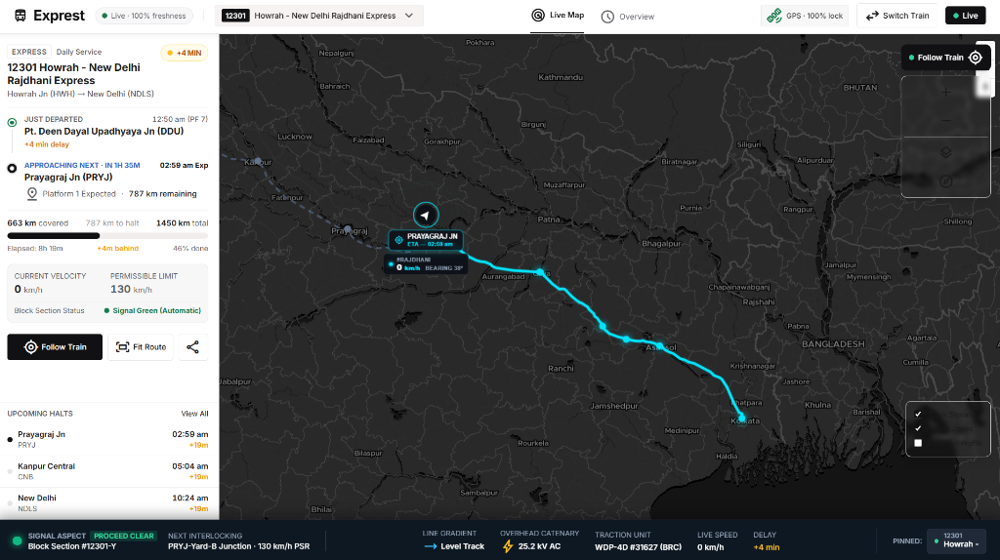
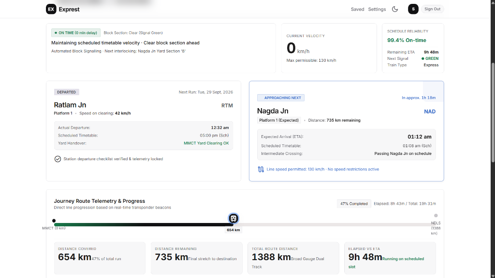
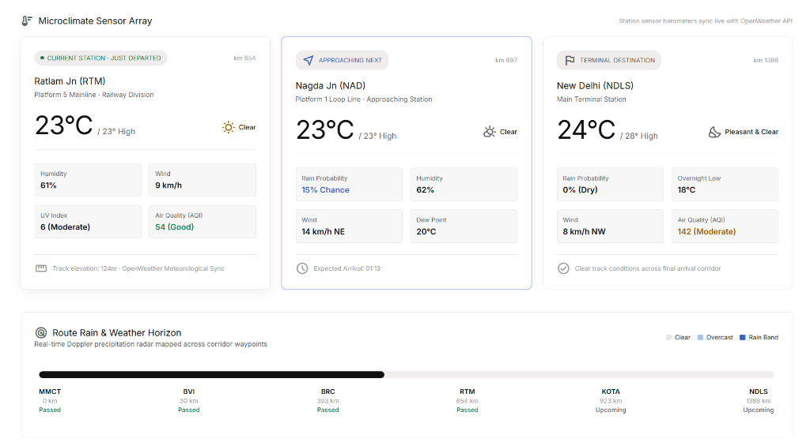
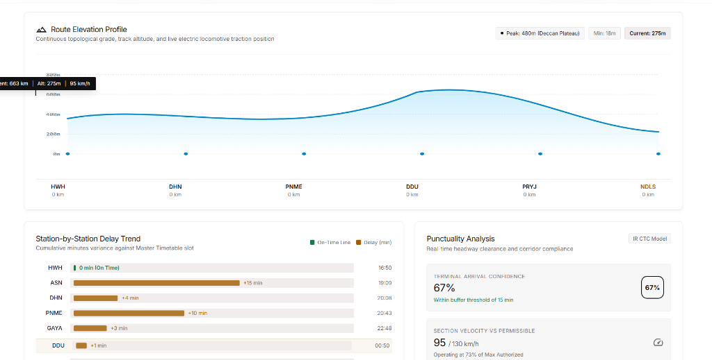
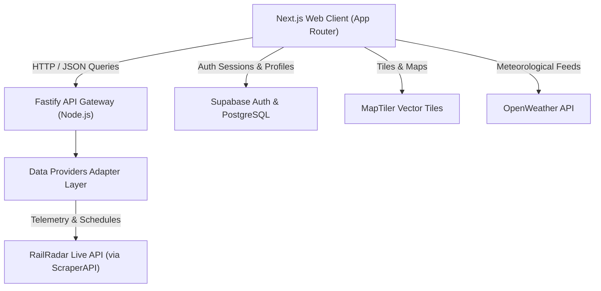

<div align="center">
  <h1>🚄 Exprest</h1>
  <p><strong>Next-Gen Live Train Tracking & Journey Analytics</strong></p>
  <p>
    <a href="https://exprest.vercel.app/"><strong>Explore Live App »</strong></a>
    ·
    <a href="#-getting-started"><strong>Deploy Your Own</strong></a>
  </p>
  
  [](https://opensource.org/licenses/MIT)
  []()
  []()
  []()
  []()
</div>

<br />

Exprest is a beautifully crafted, real-time train telemetry and journey mapping platform designed for Indian Railways. Built with a modern Turborepo monorepo stack, it provides live GPS radar, route geometries, weather conditions, and seamless authentication—all wrapped in a stunning dark-mode UI.

---

## 📸 Sneak Peek

| 🗺️ Live Radar Map | 📍 Journey Overview |
| :---: | :---: |
|  |  |
| **Track trains with smooth MapLibre vector tiles and a glowing HUD radar marker.** | **Monitor real-time velocity, distance remaining, and schedule reliability.** |

| 🌤️ Route Weather Companion | 📊 Delay Analytics & Elevation |
| :---: | :---: |
|  |  |
| **Check ambient microclimate conditions and precipitation probability along your route.** | **View exact delay trends, punctuality confidence, and route elevation profiles.** |

---

## ✨ Features

- **📡 Real-Time GPS Telemetry:** Live train tracking updated every 500ms using Server-Sent Events (SSE).
- **🗺️ Interactive Vector Maps:** Fluid MapLibre GL mapping with custom dark-mode tiles via MapTiler.
- **⏱️ Comprehensive Running Charts:** Live delay calculations, upcoming stops, and actual vs scheduled ETAs.
- **🌤️ Journey Companion:** Contextual weather data, speed/heading tracking, and nearby POIs.
- **🔗 Shareable Links:** Generate secure, unique URLs to share your active journey with friends or family.
- **🔐 Secure Authentication:** Google OAuth and Email login powered by Supabase with Row Level Security (RLS).
- **🛡️ Cloudflare Bypass:** Built-in ScraperAPI proxy support to ensure reliable data fetching on cloud platforms (Render/AWS).

---

## 🛠️ Tech Stack & Architecture



### Core Technologies

- **Frontend App (`apps/web`)**: Next.js 14 (App Router), React 18, Supabase SSR, Tailwind CSS, TanStack Query, MapLibre GL, Recharts, Zustand.
- **Backend Service (`apps/api`)**: Node.js, Fastify, TypeScript, Zod, Pino Logging, `@fastify/rate-limit`.
- **Database & Auth**: Supabase Auth (Email & Google OAuth) + Supabase PostgreSQL with Row Level Security (RLS).
- **Shared Packages (`packages/`)**: Monorepo tooling powered by **Turborepo** for shared types (`@exprest/types`), UI components (`@exprest/ui`), and configs.

---

## 🚀 Getting Started

### Prerequisites

Ensure you have the following installed on your environment:

- **Node.js**: `v18.0.0` or higher
- **pnpm**: `v9.0.0` or higher

```bash
# Clone the repository
git clone https://github.com/Sujalkan07/Exprest.git
cd Exprest

# Install monorepo dependencies
pnpm install

# Start development servers
pnpm dev
```

---

## ⚙️ Production Setup & Deployment

Follow these instructions to set up authentication, database migrations, environment variables, and production builds.

### 1. Supabase Auth & Database Setup
1. Create a new project on the [Supabase Dashboard](https://supabase.com/dashboard).
2. Go to **SQL Editor**, paste the contents of [`supabase/migrations/001_create_profiles.sql`](supabase/migrations/001_create_profiles.sql), and click **Run**. This creates the `public.profiles` table with RLS and automated registration triggers.
3. Enable **Google OAuth** in Authentication -> Providers.

### 2. Environment Variables Configuration

#### Frontend (`apps/web/.env.local`)
```env
NEXT_PUBLIC_API_URL=https://your-api-domain.com
NEXT_PUBLIC_MAPTILER_KEY=your_maptiler_api_key
NEXT_PUBLIC_OPENWEATHER_KEY=your_openweather_api_key
NEXT_PUBLIC_SUPABASE_URL=https://your-supabase-project-ref.supabase.co
NEXT_PUBLIC_SUPABASE_ANON_KEY=your_supabase_anon_key
```

#### Backend (`apps/api/.env`)
```env
PORT=4000
NODE_ENV=production
PUBLIC_APP_URL=https://your-frontend-domain.com

# Server-side API Keys
RAILRADAR_API_KEY=your_railradar_api_key
MAPTILER_API_KEY=your_maptiler_api_key
OPENWEATHER_API_KEY=your_openweather_api_key
OPENTOPOGRAPHY_API_KEY=your_opentopography_api_key

# ScraperAPI Proxy (Required to bypass Cloudflare on Render/AWS)
SCRAPER_API_KEY=your_scraperapi_key
```

### 3. Hosting Platform Configuration

| Hosting Service | Target App | Build Command | Start Command |
| :--- | :--- | :--- | :--- |
| **Vercel** | Frontend (`apps/web`) | `pnpm build` | `pnpm start` |
| **Render** | Backend (`apps/api`) | `pnpm install --prod=false && pnpm --filter @exprest/types build && pnpm --filter @exprest/api build` | `node apps/api/dist/app.js` |

---

## 📜 Scripts & Commands

Run these scripts from the repository root:

| Command | Description |
| :--- | :--- |
| `pnpm dev` | Starts frontend and backend development servers concurrently. |
| `pnpm build` | Compiles all apps and shared packages for production. |
| `pnpm typecheck` | Executes TypeScript type safety checks across all workspace projects. |
| `pnpm lint` | Runs linting rules across the codebase. |

---

## 📄 License

This project is licensed under the [MIT License](LICENSE).

---

<div align="center">
  <sub>Built with precision for Indian Railways enthusiasts and daily commuters.</sub>
</div>
