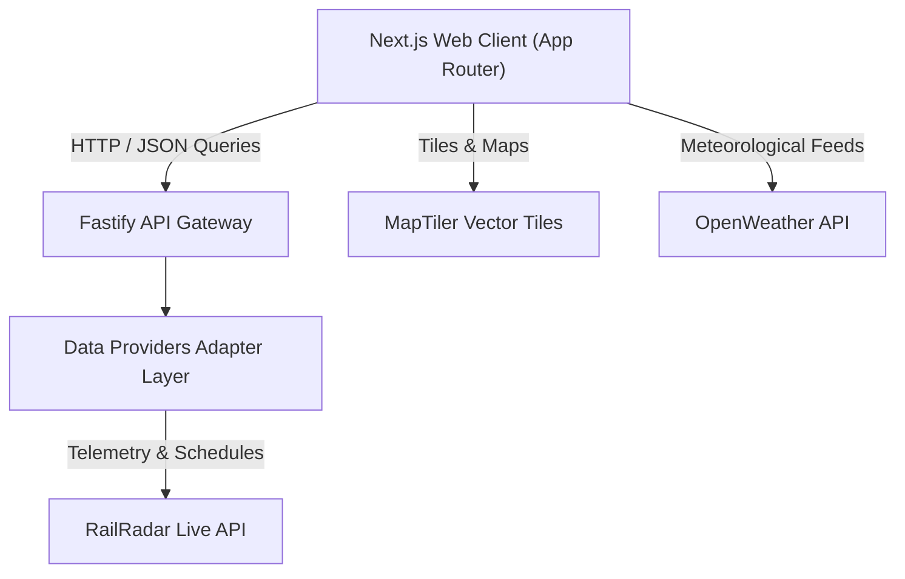

<div align="center">

# Exprest — Live Train Tracking & Journey Intelligence

**High-precision real-time telemetry, vector radar tracking, and route intelligence for Indian Railways.**

[](https://nextjs.org/)
[](https://fastify.dev/)
[](https://www.typescriptlang.org/)
[](https://turbo.build/)
[](https://tailwindcss.com/)

---

</div>

## 📌 Table of Contents

- [Overview](#-overview)
- [Key Features](#-key-features)
- [Architecture & Tech Stack](#-architecture--tech-stack)
- [Repository Structure](#-repository-structure)
- [Getting Started](#-getting-started)
  - [Prerequisites](#prerequisites)
  - [Installation](#installation)
  - [Environment Configuration](#environment-configuration)
  - [Running the Platform](#running-the-platform)
- [API Integrations](#-api-integrations)
- [Scripts & Commands](#-scripts--commands)
- [License](#-license)

---

## 🚀 Overview

**Exprest** is a modern, full-stack monorepo application engineered for high-precision live train tracking, schedule analytics, and route intelligence across the Indian Railways network. By synthesizing real-time transponder data, official NTES/RailRadar telemetry, high-resolution vector maps, and ambient meteorological feeds, Exprest presents actionable journey insights through a clean, calm, and distraction-free interface.

---

## ✨ Key Features

| Feature | Description |
| :--- | :--- |
| 🛰️ **Live Vector Radar View** | MapLibre GL-powered dark vector radar map featuring glowing route paths, live train headings, velocity tooltips, and station transponders. |
| ⏱️ **Real-Time Telemetry & Status** | Dynamic tracking of block section signals, speed limits, scheduled vs. actual arrival/departure times, and next station ETAs. |
| 📋 **Complete Running Chart** | Comprehensive station-by-station itinerary table detailing delay variances, halt durations, platform assignments, and live status flags. |
| 🚃 **Coach Composition Array** | Visual physical rake layout specifying coach positioning (LHB/ICF), engine heading, pantry placement, and onboard catering services. |
| 📊 **Journey Analytics & Trends** | Schedule reliability ratings, velocity profiles, delay trend heatmaps, and topographic elevation contours. |
| 🌤️ **Travel Companion & Weather Horizon** | Real-time station microclimate forecasts and route rain radar powered by OpenWeather API. |
| 🌙 **Theme & Personalization** | Native Light & Dark mode support with zero-FOUC (flash of unstyled content) persistence via design tokens. |
| 🔐 **Authentication Portal** | Secure session management supporting Email/Password and Google OAuth sign-in workflows. |

---

## 🛠️ Architecture & Tech Stack

Exprest is structured as a TypeScript monorepo using **pnpm Workspaces** and **Turborepo** for build caching and task orchestration.



### Core Technologies

- **Frontend App (`apps/web`)**: Next.js 14 (App Router), React 18, Tailwind CSS, TanStack Query, MapLibre GL, Recharts, Zustand.
- **Backend Service (`apps/api`)**: Node.js, Fastify, TypeScript, Zod, Pino Logging, `@fastify/rate-limit`.
- **Shared Packages (`packages/`)**:
  - `@exprest/types`: Centralized TypeScript interface definitions for trains, runs, stations, and telemetry.
  - `@exprest/ui`: Design tokens, global CSS variables, and shared UI component primitives.
  - `@exprest/config`: Shared ESLint, Tailwind, and TypeScript configurations.

---

## 📁 Repository Structure

```text
Exprest/
├── apps/
│   ├── api/                    # Fastify backend service & data provider adapters
│   │   ├── src/
│   │   │   ├── providers/      # RailRadar & external API integration layer
│   │   │   ├── routes/         # REST API endpoints (/api/v1/journeys, /shares)
│   │   │   └── app.ts          # Fastify server initialization
│   │   └── package.json
│   └── web/                    # Next.js 14 frontend web application
│       ├── app/                # App Router pages (Home, Journey Overview, Live Map, Analytics, Companion, Auth)
│       ├── components/         # React UI components (Radar Map, Search, Header, Dark Mode)
│       └── package.json
├── packages/
│   ├── config/                 # Shared TypeScript & build configs
│   ├── types/                  # Shared domain data models
│   └── ui/                     # Design tokens and global CSS styles
├── package.json                # Root monorepo workspace configuration
├── turbo.json                  # Turborepo pipeline configuration
└── README.md
```

---

## ⚙️ Getting Started

### Prerequisites

Ensure you have the following installed on your environment:

- **Node.js**: `v18.0.0` or higher
- **pnpm**: `v9.0.0` or higher

---

### Installation

Clone the repository and install workspace dependencies:

```bash
# Clone the project repository
git clone https://github.com/Sujalkan07/Exprest.git

# Navigate into the project directory
cd Exprest

# Install monorepo dependencies
pnpm install
```

---

### Environment Configuration

Exprest requires environment variables for map rendering and telemetry APIs.

#### 1. Web Application Configuration (`apps/web/.env.local`)

Create a `.env.local` file inside the `apps/web` directory:

```env
# API Endpoint URL (Local or Remote)
NEXT_PUBLIC_API_URL=http://<api-host>:4000

# MapTiler Vector Map Key
NEXT_PUBLIC_MAPTILER_KEY=your_maptiler_api_key

# OpenWeather API Key (Weather Companion)
NEXT_PUBLIC_OPENWEATHER_KEY=your_openweather_api_key
```

#### 2. Backend Service Configuration (`apps/api/.env`)

Create a `.env` file inside the `apps/api` directory:

```env
# Server Port
PORT=4000

# RailRadar API Telemetry Key
RAILRADAR_API_KEY=your_railradar_api_key
```

---

### Running the Platform

To launch both the web frontend and API backend services concurrently in development mode:

```bash
# Start all workspace services concurrently
pnpm dev
```

Upon launching:
- **Web Frontend Application**: Available on default port `3000`
- **Backend API Gateway**: Available on default port `4000`

---

## 📡 API Integrations

| Provider | Purpose | Usage Scope |
| :--- | :--- | :--- |
| **RailRadar API** | Real-time train positions, NTES live statuses, delay reports, route geometries, and timetable schedules. | API Service Adapter |
| **MapTiler** | High-performance dark-vector tile rendering for map canvas views. | Frontend MapLibre Engine |
| **OpenWeather API** | Microclimate station observations, ambient temperature, humidity, wind vector, and route rain horizon. | Frontend Travel Companion |

---

## 🛠️ Scripts & Commands

Run these scripts from the repository root:

| Command | Description |
| :--- | :--- |
| `pnpm dev` | Starts frontend and backend development servers concurrently. |
| `pnpm dev:turbo` | Launches development servers with Turborepo task orchestration. |
| `pnpm build` | Compiles all apps and shared packages for production. |
| `pnpm typecheck` | Executes TypeScript type safety checks across all workspace projects. |
| `pnpm lint` | Runs linting rules across the codebase. |

---

## 📄 License

This project is licensed under the [MIT License](LICENSE).

---

<div align="center">
  <sub>Built with precision for Indian Railways enthusiasts and daily commuters.</sub>
</div>
